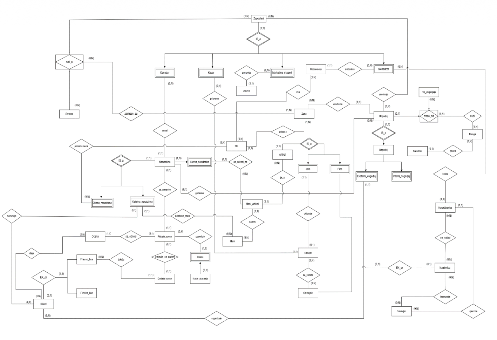
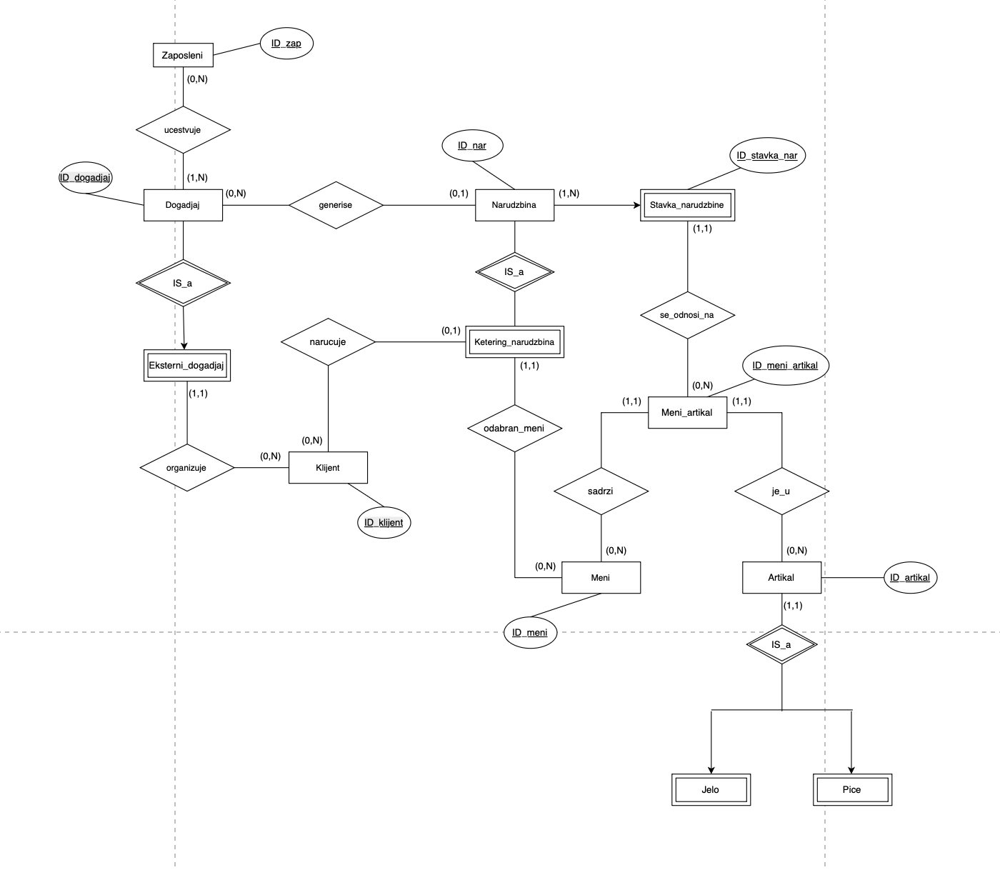
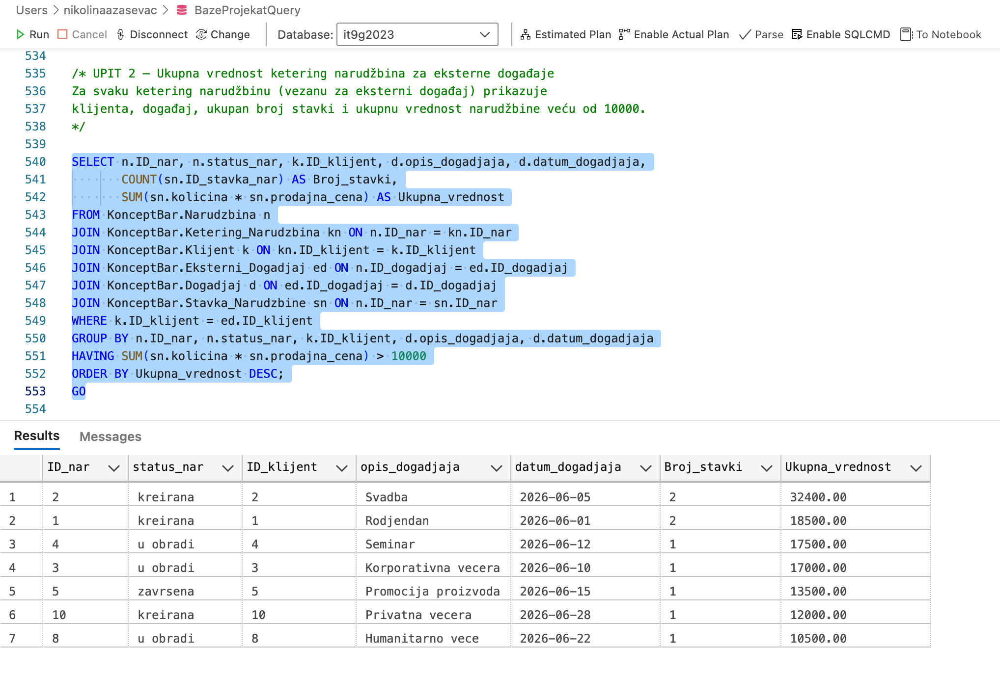
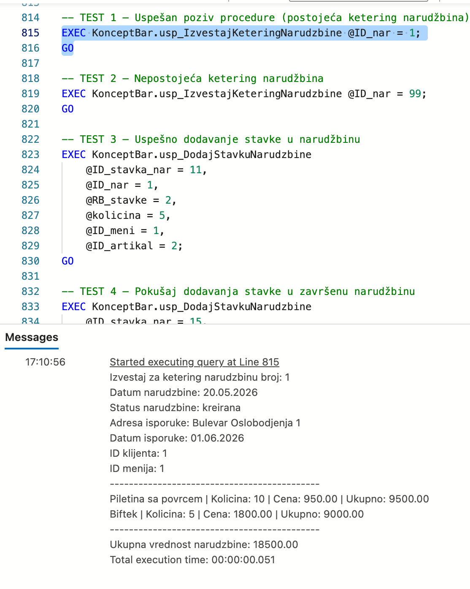
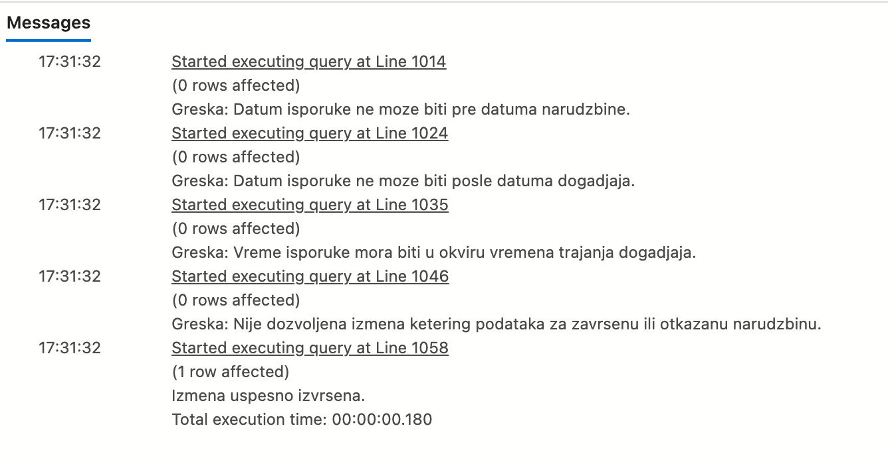
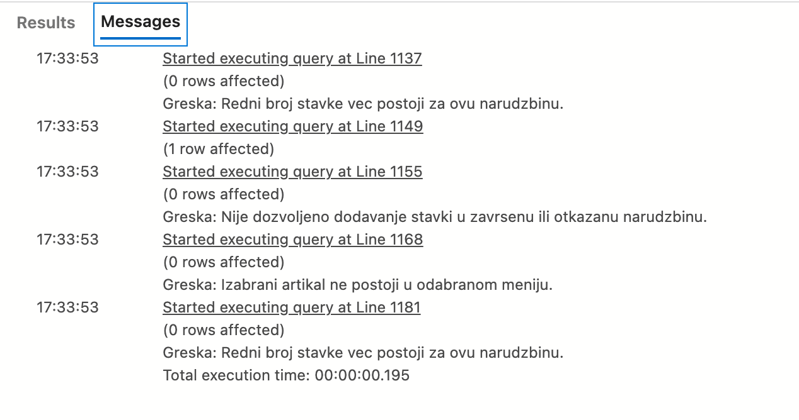

# Concept Bar — Catering Orders Database (SQL Server)

T-SQL implementation of the catering subschema of a concept bar information system: clients order catering for external events, orders contain items from menus, and employees are assigned to events.

The full database was designed in a team for a real client; this subschema was implemented independently.

## Subschema

## Tables (13)

Zaposleni, Klijent, Dogadjaj, Eksterni_Dogadjaj, Narudzbina, Ketering_Narudzbina, Stavka_Narudzbine, Artikal, Jelo, Pice, Meni, Meni_Artikal, Ucestvuje

Constraints: PRIMARY KEY, FOREIGN KEY, NOT NULL, UNIQUE, CHECK. Each table is seeded with 10+ rows.

## Database objects

| Type                  | Name                           | Purpose                                                                                       |
| --------------------- | ------------------------------ | --------------------------------------------------------------------------------------------- |
| Sequence              | KlijentSeq, NarudzbinaSeq      | Automatic ID generation                                                                       |
| Index                 | IX_Dogadjaj_Datum              | Faster search and sorting of events by date                                                   |
| Scalar function       | fn_UkupnaVrednostNarudzbine    | Total value of an order                                                                       |
| Table-valued function | fn_KeteringNarudzbineKlijenta  | All catering orders of a client                                                               |
| Procedure             | usp_IzvestajKeteringNarudzbine | Full report for a catering order, using a cursor over order items                             |
| Procedure             | usp_DodajStavkuNarudzbine      | Adds an order item after business rule checks, in a transaction with TRY...CATCH and ROLLBACK |
| Trigger (AFTER)       | tr_ProveraDatumaIsporuke       | Validates delivery date and time against the order and event                                  |
| Trigger (INSTEAD OF)  | tr_AzuriranjeCeneStavke        | Always writes the correct menu price into order items                                         |

Business rule violations raise custom errors (50001–50007) with THROW.

## Queries

Five analytical queries using joins of up to 7 tables, SUM / COUNT / AVG aggregations, GROUP BY with HAVING, and subqueries.

## Results

Order value per catering order (query 2):

Catering order report printed by a procedure using a cursor:

Trigger tests: each business rule violation is rejected with a custom error:

## How to run

Open `catering_database.sql` in SQL Server Management Studio and execute the whole script (F5).
It creates the `KonceptBarDB` database and the `KonceptBar` schema, seeds the data, and runs tests for every function, procedure and trigger.
The script can be run repeatedly: it drops existing objects first.

## Author

Nikolina Azaševac — Information Systems Engineering, Faculty of Technical Sciences, University of Novi Sad
